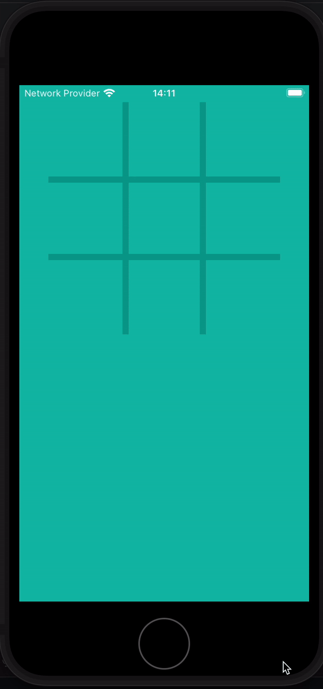

# Tic Tac Toe React Native

A simple Tic Tac Toe project on React Native to test how to use Re animated with SVGs.
I took inspiration from the [Google Tic Tac Toe](https://www.google.com/search?q=google+tic+tac+toe&oq=google+tic+tac&gs_lcrp=EgZjaHJvbWUqBwgAEAAYgAQyBwgAEAAYgAQyBggBEEUYOTIHCAIQABiABDIICAMQABgWGB4yCAgEEAAYFhgeMggIBRAAGBYYHjIICAYQABgWGB4yCAgHEAAYFhgeMggICBAAGBYYHjIICAkQABgWGB7SAQkxMDcyNGowajSoAgCwAgA&sourceid=chrome&ie=UTF-8)

